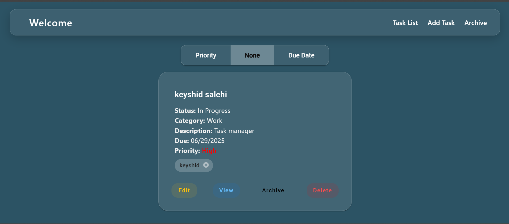

# 📝 Task Tracker App

This is a simple and clean Task Tracker App built with **Angular 15**, **Angular Material**, and **SCSS**. You can add, view, update, delete, and archive your tasks. It supports form validation, sorting by priority or due date, responsive design, and even shows alerts and tag autocomplete from a public API.

---

## 🚀 Features

-  Add / Edit / Delete Tasks  
-  Archive and Unarchive Tasks  
-  Priority Sorting (Low, Medium, High)  
-  Due Date Sorting and Overdue Highlight  
-  Tag Autocomplete (fetched from public API)  
-  Custom Validators (no past dates, max tags)  
-  View Task Details  
-  Truncate long descriptions  
-  Fully Responsive and Clean UI  
-  Angular Material + SCSS  
-  Dockerized for easy deployment

---

## 📸 Screenshot

Here's a quick look at the app interface:




---

## 📦 Installation (Development)

1. **Clone the repo**

```bash
git clone https://github.com/your-username/task-tracker.git
cd task-tracker
```

2. **Install dependencies**

```bash
npm install
```

3. **Run locally**

```bash
ng serve
```

Then open your browser and go to `http://localhost:4200`

---

## 🐳 Docker Support

To run this app in a Docker container:

### 1. **Build the Docker image**

```bash
docker build -t task-tracker-app .
```

### 2. **Run the container**

```bash
docker run -p 80:80 task-tracker-app
```

Then open your browser and go to `http://localhost`

---

## 🧰 Tech Stack

- **Angular 15+**
- **Angular Material**
- **RxJS**
- **SCSS**
- **TypeScript**
- **Docker**
- **Public REST API** for tag suggestions


